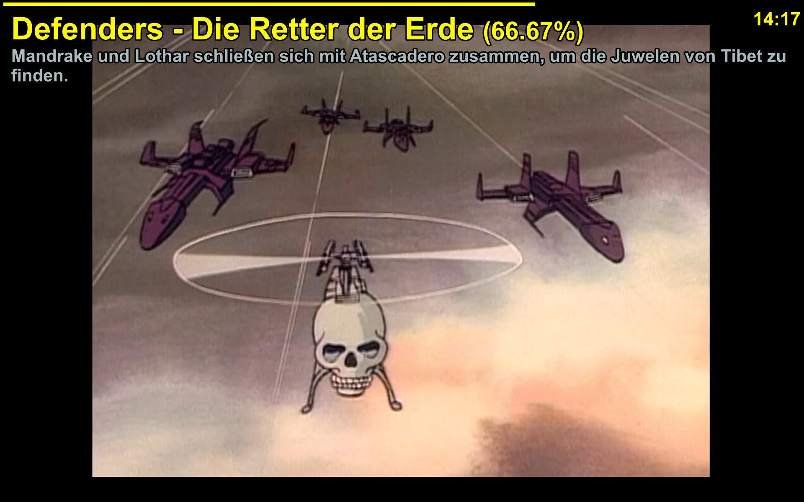
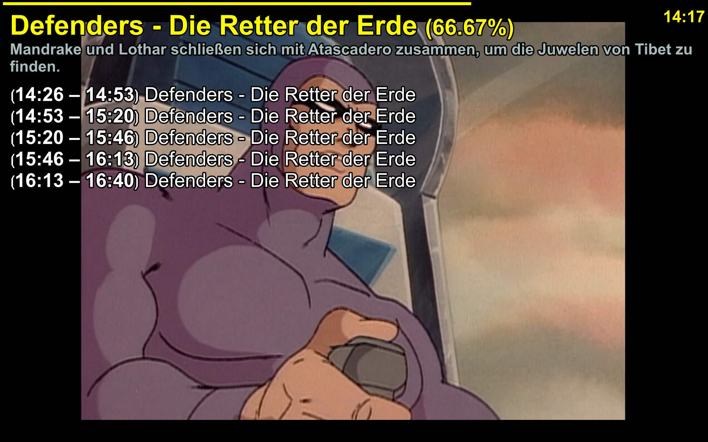
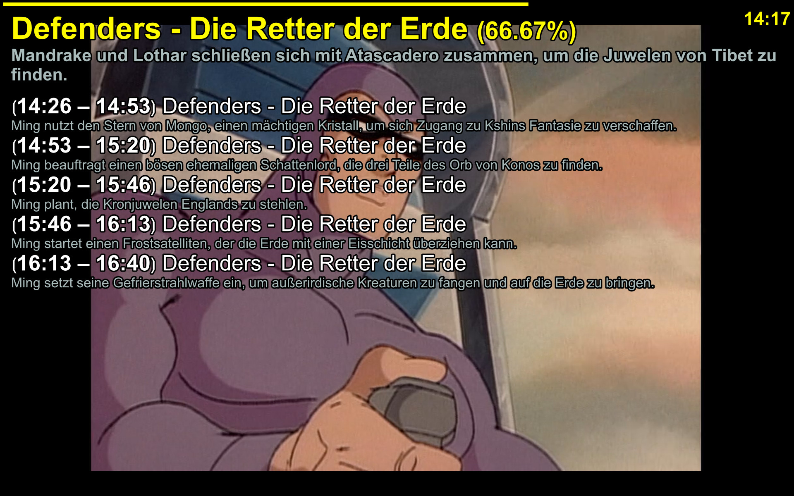

# mpvEPG

EPG overlay for [mpv](https://mpv.io) that loads XMLTV data and displays the current programme and upcoming entries directly in the player.

## Screenshot





## Features

- Current programme with progress bar
- Upcoming programmes in the same overlay
- XMLTV support from a configured folder
- Optional auto-download of EPG files from M3U `url-tvg` entries
- `tvg-shift` handling via `utc_offset`
- Chapter markers based on the active channel
- Configurable colors, sizes and duration

## Requirements

- mpv with Lua support
- XMLTV files in XML format
- Optional: M3U playlist with `#EXTM3U` and `url-tvg=...`

The script already includes the required SLAXML parser, so no extra Lua dependency is needed.

## Installation

Copy `main.lua` into your mpv scripts directory:

- Linux: `~/.config/mpv/scripts/`
- Windows: `%APPDATA%\mpv\scripts\`
- portable mpv: `scripts/` in the mpv installation directory

You can also load it explicitly with a command line option:

```bash
mpv --script=/path/to/main.lua
```

## Configuration

Set the XMLTV directory in `mpv.conf` or via `script-opts`:

```ini
script-opts=mpvEPG-epg_dir=~/epg
```

Common options:

```ini
script-opts=mpvEPG-epg_dir=~/epg,mpvEPG-utc_offset=1,mpvEPG-duration=8,mpvEPG-max_upcoming=5,mpvEPG-epg_cache_hours=12
```

Available settings include:

- `epg_dir`: folder containing XMLTV `.xml` files
- `utc_offset`: offset between UTC and local time, for example `2` for UTC+2
- `duration`: time in seconds before the overlay disappears
- `max_upcoming`: maximum number of upcoming programmes shown
- `epg_cache_hours`: how long a cached EPG file stays fresh before re-downloading
- color and font size options such as `titleColor`, `subtitleColor`, `descColor`, `titleSize`, `upcomingTitleSize`

## M3U auto-download

If the active playlist is an M3U file, the script reads the header and checks for `url-tvg` entries. Example:

```text
#EXTM3U url-tvg="https://example.com/epg.xml.gz,https://example.com/epg2.xml.gz" tvg-shift="2"
```

The script then downloads stale EPG files into the configured `epg_dir` and reloads them automatically.

## Usage

Press `h` to toggle the EPG overlay.

Repeated presses cycle through the display modes:

1. Current programme only
2. Current programme + upcoming programmes without descriptions
3. Current programme + upcoming programmes with descriptions

The script also refreshes the overlay when the media file changes.

## License

This project is licensed under the MIT License. See [LICENSE.md](LICENSE.md) for details.
